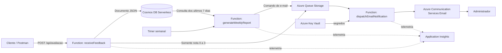

# FIAP Feedback Platform — Tech Challenge Fase 4

Plataforma serverless para receber avaliacoes de aulas, identificar feedbacks criticos, notificar administradores e gerar relatorios semanais. A solucao foi desenhada para atender aos requisitos de **Cloud Computing, Serverless, Deploy automatizado, monitoramento, seguranca e governanca**.

## Visao rapida

- **Cloud:** Microsoft Azure, modelo de nuvem publica.
- **Computacao:** Azure Functions em plano Consumption (FaaS).
- **Persistencia:** Azure Cosmos DB for NoSQL no modo serverless.
- **Mensageria:** Azure Queue Storage.
- **Notificacoes:** Azure Communication Services Email.
- **Monitoramento:** Application Insights + Log Analytics.
- **Segredos:** Azure Key Vault.
- **Infraestrutura como codigo:** Bicep.
- **CI/CD:** GitHub Actions.
- **Runtime:** Java 21.

## Arquitetura



## Separacao de responsabilidades

| Funcao | Gatilho | Responsabilidade unica |
|---|---|---|
| `receiveFeedback` | HTTP POST | Validar, classificar e persistir o feedback; enfileirar um aviso quando for critico. |
| `generateWeeklyReport` | Timer | Consultar os feedbacks dos ultimos sete dias, calcular os indicadores e enfileirar o relatorio. |
| `dispatchEmailNotification` | Queue | Enviar qualquer notificacao de e-mail preparada pelas funcoes produtoras. |

A fila desacopla o recebimento do feedback do envio do e-mail. Se o provedor de e-mail estiver indisponivel, o feedback permanece salvo e a mensagem e reprocessada pelo runtime. A configuracao `maxDequeueCount: 5` direciona falhas persistentes para a fila `email-notifications-poison`.

## Regra de urgencia

O enunciado informa a nota de 0 a 10 e exige uma urgencia, mas nao define a conversao. A decisao de negocio documentada neste projeto e:

| Nota | Urgencia | Acao |
|---|---|---|
| 0 a 3 | `CRITICA` | Salva e dispara notificacao imediata. |
| 4 a 6 | `ATENCAO` | Salva e aparece no relatorio semanal. |
| 7 a 10 | `NORMAL` | Salva e aparece no relatorio semanal. |

## Endpoint

### `POST /api/avaliacao`

O endpoint usa `AuthorizationLevel.FUNCTION`. Em Azure, informe a function key no parametro `code` ou no cabecalho `x-functions-key`.

```json
{
  "descricao": "A aula apresentou erros durante o laboratorio.",
  "nota": 2
}
```

Resposta `201 Created`:

```json
{
  "id": "b0af1174-b33f-4e66-9df3-bbfcc813e98f",
  "descricao": "A aula apresentou erros durante o laboratorio.",
  "nota": 2,
  "urgencia": "CRITICA",
  "dataEnvio": "2026-07-28T20:00:00Z"
}
```

Validacoes:

- `descricao` obrigatoria, nao vazia e limitada a 1.000 caracteres;
- `nota` obrigatoria e entre 0 e 10;
- JSON malformado retorna `400`;
- todas as respostas incluem `X-Correlation-Id`.

## Atendimento aos requisitos

| Requisito do desafio | Implementacao |
|---|---|
| Ambiente cloud | Todos os componentes executam no Microsoft Azure. |
| Serverless obrigatorio | Tres Azure Functions, Cosmos DB serverless e plano Consumption. |
| Minimo de duas funcoes | Tres funcoes com responsabilidades separadas. |
| Banco de dados | Cosmos DB for NoSQL, container `feedbacks`, particao `/partitionKey`. |
| Deploy automatizado | GitHub Actions e Bicep. |
| Aplicacao monitorada | Application Insights, Log Analytics e logs estruturados. |
| Notificacao critica | Avaliacoes de 0 a 3 geram mensagem na fila e e-mail imediato. |
| Relatorio semanal | Timer configuravel, media, totais por dia, urgencia e detalhamento. |
| Seguranca e governanca | HTTPS, TLS 1.2, Function Key, Key Vault, RBAC, tags, segredos fora do Git. |
| Codigo documentado | README, documentos tecnicos, testes e Postman Collection. |

## Executar os testes

Requisitos: JDK 21 e Maven 3.9+.

```bash
mvn clean verify
```

Relatorio de cobertura:

```text
target/site/jacoco/index.html
```

## Executar localmente

Requisitos adicionais:

- Azure Functions Core Tools v4;
- Azurite para a fila local;
- um Cosmos DB de desenvolvimento ou o emulador compativel;
- `EMAIL_PROVIDER=log` para simular o envio sem custo.

```bash
cp local.settings.example.json local.settings.json
mvn clean package
mvn azure-functions:run
```

No Windows PowerShell:

```powershell
Copy-Item local.settings.example.json local.settings.json
mvn clean package
mvn azure-functions:run
```

Chamada local:

```bash
curl -X POST "http://localhost:7071/api/avaliacao" \
  -H "Content-Type: application/json" \
  -H "X-Correlation-Id: demo-001" \
  -d '{"descricao":"Aula muito boa","nota":9}'
```

## Deploy da infraestrutura

```bash
az login
az group create --name rg-fiapfeedback --location brazilsouth
az deployment group create \
  --resource-group rg-fiapfeedback \
  --template-file infra/main.bicep \
  --parameters @infra/main.parameters.json
```

Consulte os outputs:

```bash
az deployment group show \
  --resource-group rg-fiapfeedback \
  --name main \
  --query properties.outputs
```

## Configurar e-mail real

O Bicep deixa `EMAIL_PROVIDER=log` inicialmente para permitir o deploy sem depender da configuracao manual de dominio. Depois de criar um recurso **Azure Communication Services**, um **Email Communication Services**, provisionar/conectar um dominio e obter o remetente validado:

```bash
az keyvault secret set \
  --vault-name <KEY_VAULT_NAME> \
  --name acs-email-connection-string \
  --value '<CONNECTION_STRING>'

az keyvault secret set \
  --vault-name <KEY_VAULT_NAME> \
  --name admin-email \
  --value 'administrador@exemplo.com'

az functionapp config appsettings set \
  --resource-group rg-fiapfeedback \
  --name <FUNCTION_APP_NAME> \
  --settings EMAIL_PROVIDER=azure ACS_EMAIL_SENDER='DoNotReply@dominio-validado.azurecomm.net'
```

Reinicie a Function App depois de cadastrar os segredos:

```bash
az functionapp restart --resource-group rg-fiapfeedback --name <FUNCTION_APP_NAME>
```

## Deploy do codigo

Manual:

```bash
mvn -DfunctionAppName=<FUNCTION_APP_NAME> clean package
mvn -DfunctionAppName=<FUNCTION_APP_NAME> azure-functions:deploy
```

Automatizado: configure OIDC no GitHub e os secrets `AZURE_CLIENT_ID`, `AZURE_TENANT_ID` e `AZURE_SUBSCRIPTION_ID`; em seguida, execute o workflow **Deploy Azure**.

## Relatorio semanal

Padrao de producao:

```text
0 0 11 * * 1
```

Isso executa toda segunda-feira as 11:00 UTC, equivalente a 08:00 no horario de Brasilia sem horario de verao.

Para o video, altere temporariamente para executar a cada dois minutos:

```text
0 */2 * * * *
```

Depois da demonstracao, restaure a agenda semanal.

## Monitoramento

Consultas KQL sugeridas no Application Insights:

```kusto
traces
| where message contains "event=feedback.created"
| order by timestamp desc
```

```kusto
traces
| where message contains "event=email.failed"
   or message contains "event=weekly_report.failed"
| order by timestamp desc
```

```kusto
requests
| summarize total=count(), failures=countif(success == false), avgDuration=avg(duration) by name
| order by total desc
```

A documentacao completa esta em [`docs/monitoramento.md`](docs/monitoramento.md).

## Postman

Importe:

```text
postman/fiap-feedback.postman_collection.json
```

Defina as variaveis:

- `baseUrl`: URL da Function App;
- `functionKey`: chave da funcao em Azure.

## Estrutura

```text
.
├── src/main/java/br/com/fiap/feedback
│   ├── application
│   ├── domain
│   ├── function
│   └── infrastructure
├── src/test/java
├── infra
├── docs
├── postman
└── .github/workflows
```

## Material da entrega

- [Arquitetura e decisoes](docs/arquitetura.md)
- [Deploy detalhado](docs/deploy.md)
- [Seguranca e governanca](docs/seguranca.md)
- [Monitoramento](docs/monitoramento.md)
- [Documentacao das funcoes](docs/funcoes-serverless.md)
- [Roteiro do video](docs/roteiro-video.md)
- [Checklist de evidencias](docs/evidencias/README.md)
- [Checklist orientado pela rubrica](docs/checklist-avaliacao.md)

## Limpeza dos recursos

Para evitar consumo de creditos:

```bash
az group delete --name rg-fiapfeedback --yes --no-wait
```
