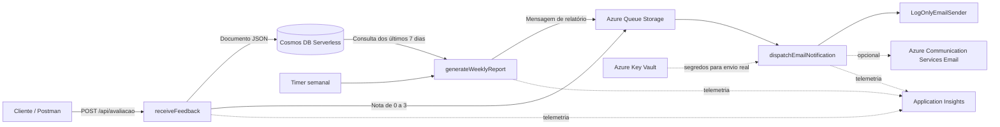

# FIAP Feedback Platform — Tech Challenge Fase 4

Plataforma serverless em Java 21 para receber avaliações de aulas, identificar feedbacks críticos, notificar administradores e gerar relatórios semanais.

> **Vídeo de demonstração:** adicionar aqui o link final do vídeo.

## Visão rápida

- **Cloud:** Microsoft Azure.
- **Computação:** Azure Functions em plano **Flex Consumption (FC1)**.
- **Runtime:** Java 21.
- **Persistência:** Azure Cosmos DB for NoSQL no modo serverless.
- **Mensageria:** Azure Queue Storage.
- **Notificações:** processamento assíncrono em modo `log`; integração com Azure Communication Services disponível por configuração.
- **Monitoramento:** Application Insights + Log Analytics.
- **Segredos:** Azure Key Vault.
- **Infraestrutura como código:** Bicep.
- **CI/CD:** GitHub Actions com autenticação OIDC.
- **Regiões utilizadas:** Function App e recursos principais em `eastus`; Cosmos DB em `westus2`.

## Arquitetura



## Funções serverless

| Função | Gatilho | Responsabilidade |
|---|---|---|
| `receiveFeedback` | HTTP POST | Validar, classificar e persistir o feedback; enfileirar notificação quando o feedback for crítico. |
| `generateWeeklyReport` | Timer Trigger | Consultar os feedbacks, calcular média e totais e enfileirar o relatório semanal. |
| `dispatchEmailNotification` | Queue Trigger | Consumir mensagens da fila e processar a notificação. |

A fila desacopla o recebimento do feedback do processamento da notificação. Falhas persistentes podem ser direcionadas para a fila `email-notifications-poison`.

## Regra de urgência

O enunciado exige uma classificação de urgência, mas não define os intervalos. A decisão adotada foi:

| Nota | Urgência | Ação |
|---|---|---|
| 0 a 3 | `CRITICA` | Persiste e gera notificação imediata. |
| 4 a 6 | `ATENCAO` | Persiste e aparece no relatório semanal. |
| 7 a 10 | `NORMAL` | Persiste e aparece no relatório semanal. |

## Endpoint publicado

### `POST /api/avaliacao`

```text
https://fiapfeedback-func-ch2q6ymmfuwhe.azurewebsites.net/api/avaliacao
```

O endpoint usa `AuthorizationLevel.FUNCTION`. Em Azure, informe a Function Key pelo cabeçalho `x-functions-key` ou pelo parâmetro `code`.

> A chave não deve ser publicada no repositório, no vídeo ou em imagens.

### Requisição

```json
{
  "descricao": "O laboratório apresentou uma falha durante a aula.",
  "nota": 2
}
```

### Resposta `201 Created`

```json
{
  "id": "b0af1174-b33f-4e66-9df3-bbfcc813e98f",
  "descricao": "O laboratório apresentou uma falha durante a aula.",
  "nota": 2,
  "urgencia": "CRITICA",
  "dataEnvio": "2026-07-29T22:00:00Z"
}
```

### Validações

- `descricao` obrigatória e limitada a 1.000 caracteres;
- `nota` obrigatória e entre 0 e 10;
- JSON inválido retorna `400`;
- respostas incluem `X-Correlation-Id`.

## Atendimento aos requisitos

| Requisito | Implementação |
|---|---|
| Ambiente cloud | Solução implantada no Microsoft Azure. |
| Serverless | Três Azure Functions e Cosmos DB Serverless. |
| Responsabilidade única | Funções separadas para entrada, relatório e notificação. |
| Banco de dados | Cosmos DB for NoSQL, database `feedbackdb`, container `feedbacks`. |
| Mensageria | Azure Queue Storage, fila `email-notifications`. |
| Deploy automatizado | GitHub Actions + Bicep + OIDC. |
| Monitoramento | Application Insights, Log Analytics e logs estruturados. |
| Notificação crítica | Notas de 0 a 3 publicam mensagem na fila. |
| Relatório semanal | Timer configurável, média e totais por dia e urgência. |
| Segurança | HTTPS, TLS 1.2, Function Key, Key Vault, RBAC e secrets fora do Git. |

## Testes

Pré-requisitos:

- JDK 21;
- Maven 3.9+.

```bash
mvn clean verify
```

Relatório de cobertura:

```text
target/site/jacoco/index.html
```

## Execução local

Pré-requisitos adicionais:

- Azure Functions Core Tools v4;
- Azurite;
- Azure Cosmos DB Emulator;
- `EMAIL_PROVIDER=log`.

```powershell
Copy-Item local.settings.example.json local.settings.json
mvn clean package
mvn azure-functions:run
```

Chamada local:

```powershell
$body = @{
    descricao = "A aula foi clara e objetiva"
    nota = 9
} | ConvertTo-Json

Invoke-RestMethod `
    -Method Post `
    -Uri "http://localhost:7071/api/avaliacao" `
    -ContentType "application/json" `
    -Body $body
```

## Deploy automatizado

O workflow **Deploy Azure**:

1. autentica no Azure por OIDC;
2. cria o Resource Group;
3. executa o Bicep;
4. cria Storage, fila, Cosmos DB, Function App, Application Insights, Log Analytics e Key Vault;
5. compila o projeto;
6. publica as Azure Functions;
7. imprime o endpoint.

Secrets configurados no ambiente `production` do GitHub:

```text
AZURE_CLIENT_ID
AZURE_TENANT_ID
AZURE_SUBSCRIPTION_ID
```

Não existe `AZURE_CLIENT_SECRET`, pois a autenticação usa OIDC.

## Relatório semanal

Configuração final:

```text
0 0 11 * * 1
```

Execução: segunda-feira às 11:00 UTC, equivalente a 08:00 no horário de Brasília.

Para demonstração, o valor pode ser alterado temporariamente para:

```text
0 */2 * * * *
```

Após o teste, o cron semanal deve ser restaurado.

## Monitoramento

Exemplo de consulta KQL para rastrear os fluxos:

```kusto
traces
| where timestamp > ago(2h)
| where message has_any (
    "feedback.created",
    "generateWeeklyReport",
    "weekly_report.generated",
    "dispatchEmailNotification",
    "email.sent"
)
| project timestamp, message, severityLevel, operation_Id
| order by timestamp desc
```

O `operation_Id` permite correlacionar etapas pertencentes à mesma execução.

## Postman

Importe:

```text
postman/fiap-feedback.postman_collection.json
```

Configure:

- `baseUrl`: URL pública da Function App;
- `functionKey`: Function Key obtida no Azure Portal.

## Estrutura

```text
.
├── src/main/java/br/com/fiap/feedback
│   ├── application
│   ├── domain
│   ├── function
│   └── infrastructure
├── src/test/java
├── infra
├── docs
├── postman
└── .github/workflows
```

## Documentação complementar

- [`docs/arquitetura.md`](docs/arquitetura.md)
- [`docs/deploy.md`](docs/deploy.md)
- [`docs/seguranca.md`](docs/seguranca.md)
- [`docs/monitoramento.md`](docs/monitoramento.md)
- [`docs/funcoes-serverless.md`](docs/funcoes-serverless.md)
- [`docs/roteiro-video.md`](docs/roteiro-video.md)
- [`docs/checklist-avaliacao.md`](docs/checklist-avaliacao.md)

## Limpeza dos recursos

Depois da gravação e da avaliação, exclua o Resource Group para evitar consumo de créditos:

```bash
az group delete --name rg-fiapfeedback --yes --no-wait
```

No Azure Portal, também é possível excluir diretamente o grupo `rg-fiapfeedback`.
